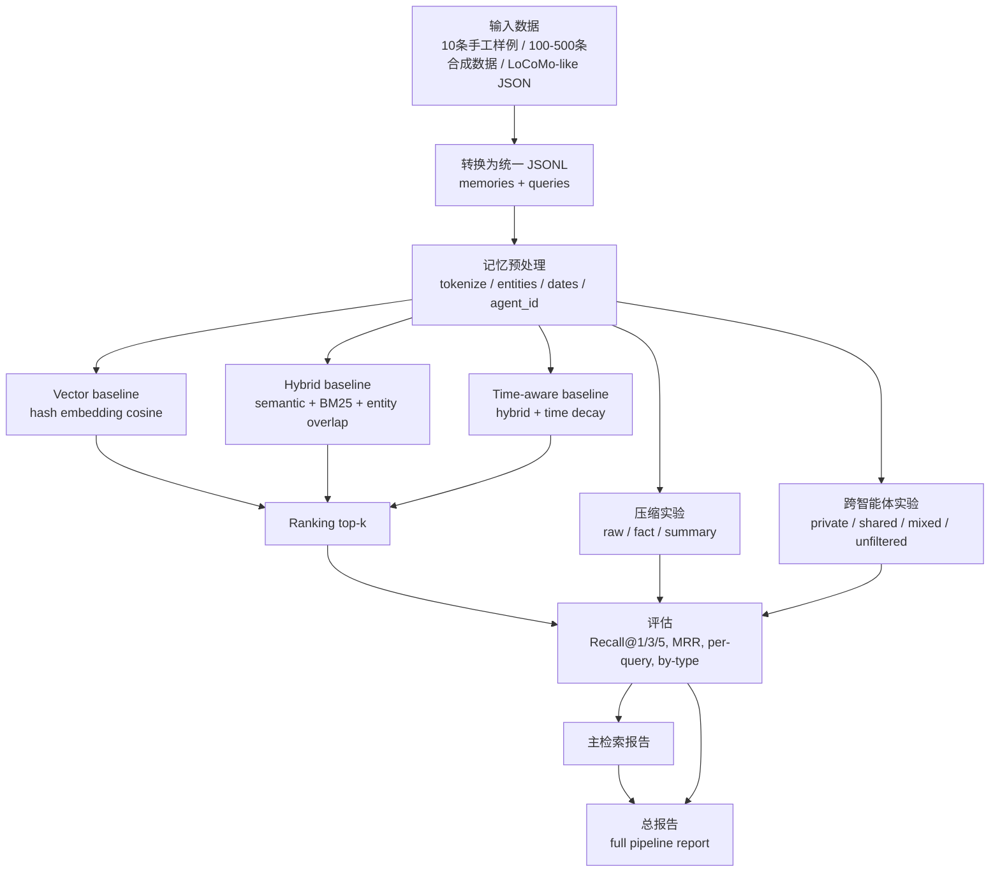
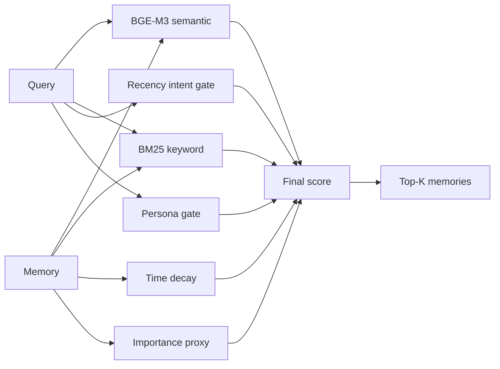

# 智能体记忆第一阶段：当前实现、流程与公式

## 1. 当前 agent 是怎么用的

当前代码还没有接入真正的在线大模型 Agent，而是先实现了一个可复现实验框架，用来验证“记忆模块”本身是否值得继续做。

也就是说，现在的 `agent_id` 主要作为记忆命名空间和权限作用域使用：

| 位置 | 当前含义 | 后续真实 Agent 中的对应关系 |
|---|---|---|
| `agent_id` | 记忆来源，例如 `retriever`、`planner`、`compressor`、`agent_a`、`agent_b` | 不同智能体、工具智能体、用户助理、任务执行器 |
| `user_id` | 用户或任务主体 | 用户、组织、项目、会话 |
| `session_id` / `turn` | 对话会话和轮次 | conversation / trajectory |
| `visibility` | 跨智能体共享实验中的权限字段 | private / shared / org / project scope |

当前实验中的“Agent B 读取 Agent A 记忆”是用数据集策略模拟的：

- `private_only`：Agent B 只能看到自己的私有记忆。
- `shared_allowed`：Agent B 可以读取 Agent A 授权共享的记忆。
- `shared_plus_private_noise`：共享记忆和同主题私有噪声同时存在。
- `unfiltered_private_first`：故意不先做权限过滤，用来验证风险。

结论很明确：跨智能体知识复用必须先做权限过滤，再做检索、重排、去重或 KV cache 复用。

## 2. 当前大模型用的是什么

当前项目已经接入过真实大模型 API，但大模型只用于 memory write / fact extraction，不作为默认检索模型。

| 模块 | 当前默认实现 | 是否需要 API key | 目的 |
|---|---|---:|---|
| 语义相似度 | `BAAI/bge-m3` 本地 embedding | 否，但需要本地模型缓存 | 当前 LoCoMo10 主实验的语义检索 |
| 零依赖基线 | deterministic hashed-vector | 否 | 离线 sanity check 和无依赖基线 |
| LLM 事实抽取 | DeepSeek 官方 API | 是 | 将长对话 turn/session 抽取为 fact-level memory |
| Agent 推理生成 | 暂未作为主实验接入 | 暂不需要 | 当前先评估记忆写入、检索、重排，不评估最终回答生成 |

因此当前整体判断是：

1. Embedding 层优先用本地 BGE-M3，避免每次检索都产生 API 成本。
2. DeepSeek API 已证明可以作为 memory writer，用于抽取结构化事实记忆。
3. OpenAI / Qwen / 其他 embedding API 可以作为后续更强 embedding baseline，而不是当前唯一依赖。
4. 真实 Agent 回答生成还不是本阶段主指标；后续若评估 end-to-end QA，再接入主推理模型。

## 3. 当前整体流程

## 4. 记忆检索方法

设查询为 \(q\)，候选记忆为 \(m_i\)。

### 4.1 语义相似度

当前默认用哈希向量模拟 embedding：

\[
\mathrm{semantic}(q,m_i)=
\cos(\mathbf{h}(q), \mathbf{h}(m_i))
=
\frac{\mathbf{h}(q)\cdot \mathbf{h}(m_i)}
{\|\mathbf{h}(q)\|\|\mathbf{h}(m_i)\|}
\]

其中 \(\mathbf{h}(\cdot)\) 是 deterministic hashed-vector 表示。后续可替换成：

\[
\mathbf{e}(x)=\mathrm{EmbeddingModel}(x)
\]

### 4.2 BM25 关键词匹配

对查询词 \(t\) 与记忆文档 \(d\)，当前实现使用标准 BM25 形式：

\[
\mathrm{BM25}(q,d)=
\sum_{t \in q}
\mathrm{IDF}(t)
\frac{f(t,d)(k_1+1)}
{f(t,d)+k_1(1-b+b\frac{|d|}{\mathrm{avgdl}})}
\]

其中当前参数：

\[
k_1=1.5,\quad b=0.75
\]

IDF 计算为：

\[
\mathrm{IDF}(t)=
\log\left(\frac{N-n_t+0.5}{n_t+0.5}+1\right)
\]

### 4.3 实体重合度

\[
\mathrm{entity}(q,m_i)=
\frac{|T(q)\cap T(E_i)|}{|T(E_i)|}
\]

其中 \(T(q)\) 是查询 token 集合，\(T(E_i)\) 是记忆实体字段展开后的 token 集合。

### 4.4 时间衰减

设查询日期与记忆日期间隔为 \(\Delta t\) 天，半衰期为 \(H\)，当前默认 \(H=45\)：

\[
\mathrm{decay}(m_i,q)=0.5^{\Delta t/H}
\]

如果记忆日期晚于查询日期，则 \(\Delta t=0\)。

### 4.5 三种打分方法

Vector baseline:

\[
S_{\mathrm{vector}}(q,m_i)=\mathrm{semantic}(q,m_i)
\]

Hybrid baseline:

\[
S_{\mathrm{hybrid}}(q,m_i)
=0.65\cdot \mathrm{semantic}
+0.30\cdot \mathrm{BM25}_{norm}
+0.05\cdot \mathrm{entity}
\]

Time-aware baseline:

\[
g(q)=
\begin{cases}
1, & q \text{ 包含 recent/latest/last/today/currently/now/since/new 等最近性意图，且不是 when/date/time 问句}\\
0, & \text{otherwise}
\end{cases}
\]

\[
S_{\mathrm{time}}(q,m_i)
=
0.70\cdot \mathrm{semantic}
+0.30\cdot \mathrm{BM25}_{norm}
+0.08\cdot g(q)\cdot \mathrm{decay}
\]

解释：这是从 LoCoMo+BGE-M3 参数搜索后采用的 adaptive time-aware 版本。它参考 Generative Agents 的 relevance + recency 思路，但不会把所有时间问题都当作“越新越好”。例如 `When did ...` 常问历史事件日期，这类问题不触发 recency boost。

Persona-aware extension:

\[
S_{\mathrm{time+persona}}(q,m_i)
=S_{\mathrm{time}}(q,m_i)
+\gamma(q)\cdot \mathrm{persona}(q,m_i)
\]

\[
\gamma(q)=
\begin{cases}
0.04, & \mathrm{type}(q)\in\{1,2,3,4\}\\
0, & \mathrm{type}(q)=5
\end{cases}
\]

其中 persona 分数是软约束：query 提到的人名匹配 memory speaker 时为 `1.0`，出现在 memory text 中时为 `0.7`，query 提到人名但 memory 不匹配时为 `-0.5`，query 未提到人名时为 `0`。

Importance-aware extension:

\[
S_{\mathrm{final}}(q,m_i)
=S_{\mathrm{time+persona}}(q,m_i)
+\eta \cdot \mathrm{importance}(m_i)
\]

当前全量 LoCoMo+BGE-M3 验证后的推荐参数为：

\[
\eta=0.06,\quad \gamma=0.04,\quad \mathrm{type}(q)\in\{1,2,3,4\}
\]

当前 importance 是不调用 LLM 的规则代理分数，用来模拟 Generative Agents 中“重要记忆更容易被再次取出”的思想。它不是人工标注真值，而是第一阶段可复现 proxy：

\[
\mathrm{importance}(m_i)=
\mathrm{clip}_{[0,1]}(
0.55I_{\mathrm{identity/goal/relation}}
+0.25I_{\mathrm{emotion}}
+0.15I_{\mathrm{long}}
+0.10I_{\mathrm{entity\_dense}}
-0.30I_{\mathrm{smalltalk}}
)
\]

其中 identity/goal/relation 包含身份、职业、关系、家庭、长期目标、偏好、重要日期等长期记忆信号；emotion 包含 proud、grateful、excited、scared、meaningful 等情绪词；smalltalk 包含 thanks、hello、goodbye 等低信息密度对话。

当前最终检索链路可以概括为：

## 5. 压缩实验方法

压缩实验分成两类。

第一类是合成数据压缩对照，比较三种记忆形态：

| Variant | 说明 |
|---|---|
| `raw` | 原始记忆 |
| `fact` | 每条原始记忆压缩成短事实，保持一对一粒度 |
| `summary` | 每 5 条记忆合并成一个 summary block |

token 成本比：

\[
R_{\mathrm{token}}(v)=
\frac{\sum_{m\in M_v}\mathrm{tokens}(m)}
{\sum_{m\in M_{\mathrm{raw}}}\mathrm{tokens}(m)}
\]

当前结果显示：`fact` 压缩把 token 成本降到约 43%，同时 500 条下 time-aware Recall@1 从 `0.240` 只小幅降到 `0.235`；`summary` 降到 `0.110`，说明过早合并会损失检索粒度。

第二类是真实 LoCoMo 压缩对照，直接使用官方字段：

| Variant | 说明 | Token Ratio | Evidence Coverage | Recall@1 | MRR |
|---|---|---:|---:|---:|---:|
| `raw_turn` | 原始 turn-level memory | 1.000 | 1.000 | 0.329 | 0.439 |
| `observation` | 官方事实级 observation | 0.281 | 0.785 | 0.400 | 0.484 |
| `session_summary` | 官方 session summary | 0.201 | 0.997 | 0.520 | 0.636 |

解释：`observation` 更接近我们想要的在线事实记忆，token 成本低且检索更准，但覆盖率不是 100%；`session_summary` 指标最高，但 gold target 变成 session 级大块，检索更容易，真实回答时还需要在摘要内部定位事实。因此推荐采用两层结构：

\[
M = M_{\mathrm{fact}} \cup M_{\mathrm{summary}}
\]

\[
\operatorname{retrieve}(q)
=
\operatorname{TopK}(q,M_{\mathrm{fact}})
\cup
\operatorname{BackoffTopK}(q,M_{\mathrm{summary}})
\]

其中 fact/observation 层负责高精度事实召回，summary 层负责上下文回溯和事实缺失兜底。

## 6. 跨智能体复用方法

跨智能体正确流程：

权限门控可以写成：

\[
\mathcal{C}(q,a)=
\{m_i\mid \mathrm{visible}(m_i,a)=1 \land \mathrm{scope}(m_i)\cap \mathrm{scope}(q)\neq \emptyset\}
\]

只在候选集合 \(\mathcal{C}(q,a)\) 上排序：

\[
\operatorname{rank}(q,a)=
\operatorname{TopK}_{m_i\in \mathcal{C}(q,a)} S(q,m_i)
\]

不能先在全集 \(M\) 上排序再过滤：

\[
\operatorname{TopK}_{m_i\in M} S(q,m_i) \rightarrow \mathrm{filter}
\]

因为未授权但内容相同的私有副本可能抢占 Top-1。当前实验中的 `unfiltered_private_first` 已经验证了这个风险。

## 7. Query-Intent 自适应路由

LoCoMo10 按 query type 分析显示，不同问题类型的最佳检索方法不同：

- Type 1：`vector` 的 MRR 最高。
- Type 2/3/4：`type_aware` 的 MRR 最高。
- Type 5：`keyword` 的 MRR 最高。

因此后续不应只依赖固定重排公式，而应加入 query-intent router：

\[
r(q)=\arg\max_{r\in\mathcal{R}} P(r\mid q)
\]

\[
\mathcal{R}=\{
\mathrm{keyword},
\mathrm{vector},
\mathrm{hybrid},
\mathrm{time\_aware},
\mathrm{type\_aware}
\}
\]

最终检索可以写成：

\[
\operatorname{retrieve}(q)
=
\operatorname{TopK}_{m_i\in \mathcal{C}(q)}
S_{r(q)}(q,m_i)
\]

在当前规则版中，可先用 LoCoMo query type 或 query intent pattern 近似：

\[
r(q)=
\begin{cases}
\mathrm{vector}, & \mathrm{type}(q)=1\\
\mathrm{type\_aware}, & \mathrm{type}(q)\in\{2,3,4\}\\
\mathrm{keyword}, & \mathrm{type}(q)=5\\
\mathrm{time\_aware}, & \mathrm{otherwise}
\end{cases}
\]

当前离线验证结果：

| Method | Recall@1 | Recall@3 | Recall@5 | MRR |
|---|---:|---:|---:|---:|
| fixed `type_aware` | 0.503 | 0.670 | 0.733 | 0.609 |
| query-type router | 0.505 | 0.674 | 0.731 | 0.611 |

paired significance test 显示该 router 的 MRR 提升尚不显著。因此下一步应从“使用数据集 type 标签的 oracle-light router”推进到“从 query 文本预测 intent 的可部署 router”，并重点避免 Type 5 上被语义相似但关键词不精确的记忆干扰。

已验证的简单 text-intent rule router：

| Method | Recall@1 | Recall@3 | Recall@5 | MRR |
|---|---:|---:|---:|---:|
| fixed `type_aware` | 0.503 | 0.670 | 0.733 | 0.609 |
| text-intent rule router | 0.489 | 0.661 | 0.715 | 0.595 |

该规则版显著退化，说明 query intent router 不能只靠粗关键词规则。下一版应采用 validation-tuned classifier：

\[
r(q)=f_{\theta}(q)
\]

其中 \(f_{\theta}\) 可以是轻量文本分类器、LLM few-shot classifier，或人工规则 + validation search 的混合系统。

当前已经加入 held-out 监督式 query-text router 基线。它将每个训练 query 在 `keyword/vector/hybrid/time_aware/type_aware` 中表现最好的方法作为伪标签：

\[
y_q=\arg\max_{r\in\mathcal{R}}\operatorname{MRR}(q,r)
\]

然后只用 query 文本训练分类器：

\[
\hat r(q)=f_\theta(\mathrm{text}(q))
\]

测试阶段使用预测出的检索方法：

\[
\operatorname{retrieve}(q)
=
\operatorname{TopK}_{m_i\in \mathcal{C}(q)}
S_{\hat r(q)}(q,m_i)
\]

当前 5 个 held-out split 的结果：

| Method | Recall@1 | Recall@3 | Recall@5 | MRR |
|---|---:|---:|---:|---:|
| fixed `type_aware` | 0.499 | 0.670 | 0.733 | 0.607 |
| supervised text router | 0.485 | 0.661 | 0.708 | 0.592 |
| oracle best method | 0.600 | 0.756 | 0.799 | 0.693 |

结论：浅层监督式文本分类器仍低于固定 `type_aware`，但 oracle best 显示 query-level 路由存在较高潜在收益。因此后续不应继续强化简单规则，而应把 intent 识别做成可验证模块，例如 LLM few-shot classifier、验证集调参的 hybrid router，或直接学习 candidate-level reranking。

进一步加入 validation-tuned text-intent router。它不直接学习 query 到方法的分类，而是先用规则得到 predicted intent：

\[
z_q=g(\mathrm{text}(q))
\]

再在训练集上为每个 intent 选择平均指标最高的方法：

\[
r_z=\arg\max_{r\in\mathcal{R}}
\frac{1}{|\mathcal{D}_{train,z}|}
\sum_{q\in\mathcal{D}_{train,z}}
\operatorname{MRR}(q,r)
\]

测试时：

\[
\operatorname{retrieve}(q)=
\operatorname{TopK}_{m_i\in \mathcal{C}(q)}
S_{r_{g(q)}}(q,m_i)
\]

5 个 held-out split 结果：

| Method | Recall@1 | Recall@3 | Recall@5 | MRR |
|---|---:|---:|---:|---:|
| fixed `type_aware` | 0.499 | 0.670 | 0.733 | 0.607 |
| validation-tuned intent router | 0.497 | 0.669 | 0.733 | 0.606 |
| oracle best method | 0.600 | 0.756 | 0.799 | 0.693 |

该版本基本恢复到 fixed `type_aware` 水平，但仍没有超过它。当前判断是：手写 route 映射会带来明显退化，验证集调参可以避免大退化；但 intent 粒度仍然过粗，距离 oracle best 仍有明显空间。

## 8. Candidate-Level 学习重排

在 query-level router 没有稳定超过 fixed `type_aware` 后，当前新增 candidate-level learned reranker。核心变化是不再先决定“这个 query 用哪个检索器”，而是把多个检索器召回的候选合并，再学习每个候选 memory 的相关性。

候选池定义为：

\[
\mathcal{C}_{union}(q)=
\bigcup_{r\in\mathcal{R}}
\operatorname{TopK}_r(q)
\]

其中：

\[
\mathcal{R}=\{\mathrm{keyword},\mathrm{vector},\mathrm{hybrid},\mathrm{time\_aware},\mathrm{type\_aware}\}
\]

每个候选的特征包含：

\[
\phi(q,m_i)=[
s_{\mathrm{semantic}},
s_{\mathrm{keyword}},
s_{\mathrm{entity}},
d_{\mathrm{time}},
g_{\mathrm{recency}},
s_{\mathrm{persona}},
s_{\mathrm{importance}},
s_{\mathrm{memory\_type}},
\{S_r(q,m_i), \operatorname{rr}_r(q,m_i)\}_{r\in\mathcal{R}}
]
\]

训练目标是候选是否命中 evidence：

\[
y_{q,i}=\mathbb{I}[m_i\in E_q]
\]

当前实现使用轻量随机森林分类器：

\[
\hat p_{q,i}=f_\theta(\phi(q,m_i))
\]

最终排序：

\[
\operatorname{retrieve}(q)
=
\operatorname{TopK}_{m_i\in\mathcal{C}_{union}(q)}
\hat p_{q,i}
\]

5 个 held-out query split 结果：

| Method | Recall@1 | Recall@3 | Recall@5 | MRR |
|---|---:|---:|---:|---:|
| fixed `type_aware` | 0.499 | 0.670 | 0.733 | 0.607 |
| candidate reranker | 0.556 | 0.732 | 0.796 | 0.661 |
| candidate oracle | 0.909 | 0.909 | 0.909 | 0.909 |

paired significance test 显示 candidate reranker 相比 fixed `type_aware` 的 MRR delta 为 `+0.0539`，95% CI `[0.0462, 0.0619]`，p-value `0.0002`。这说明当前主要改进点应从 query-level route 转向 candidate-level reranking。

当前 Top feature importance：

| Feature | Importance |
|---|---:|
| `type_aware_score` | 0.0784 |
| `time_aware_rr` | 0.0776 |
| `semantic_score` | 0.0771 |
| `time_aware_score` | 0.0762 |
| `hybrid_score` | 0.0750 |
| `type_aware_rr` | 0.0704 |

解释：模型主要利用多个检索器的分数和排序位置，同时保留语义相似度本身。这支持“多候选融合 + 学习重排”作为比单一路由更合适的方向。

按 query type 的结果显示：

| Query Type | Delta MRR | Delta Recall@5 | 判断 |
|---|---:|---:|---|
| Type 1 | +0.0288 | +0.0460 | 小幅提升 |
| Type 2 | +0.0522 | +0.0622 | 明显提升 |
| Type 3 | -0.0194 | -0.0556 | 当前短板 |
| Type 4 | +0.0515 | +0.0529 | 明显提升 |
| Type 5 | +0.0887 | +0.1108 | 收益最大 |

因此下一版方法不应只继续调随机森林参数，而应专门为 Type 3 增加多证据聚合：

多证据覆盖分析显示，Type 3 的平均 gold evidence 数为 `2.65`，多证据问题比例为 `0.675`；candidate reranker 的 Top-5 coverage ratio 为 `0.372`，略低于 fixed `type_aware` 的 `0.377`。因此 Type 3 的短板不是简单 Top-1 排序问题，而是候选集合需要覆盖多个事实。

\[
\operatorname{retrieve}_{multi}(q)
=
\operatorname{SelectSet}_{K}
\{m_i\in\mathcal{C}_{union}(q)\}
\]

其中目标不是只让第一个 evidence 排到最前，而是最大化前 K 个候选对答案所需事实集合的覆盖：

\[
\max_{S, |S|\le K}
\sum_{e\in E_q}
\mathbb{I}[\exists m_i\in S: m_i \sim e]
\]

当前已测试一个无监督启发式 set selector：保留 candidate reranker 的 Top-1，再用文本 Jaccard 去重和 memory type 多样性选择后续候选。结果 Type 3 Coverage@5 从 `0.372` 降到 `0.351`，Coverage@10 保持 `0.462` 不变。说明只在当前 Top-10 里做多样性重排不够，下一版应扩大候选池或显式拆解 query：

进一步的候选深度分析显示，Type 3 到 Top-20 时 coverage ratio 从 Top-10 的 `0.462` 提升到 `0.597`，Full@20 达到 `0.444`，说明相关证据常在更深候选中。因此推荐下一版候选池：

\[
\mathcal{C}_{deep}(q)=
\bigcup_{r\in\mathcal{R}}
\operatorname{TopK}_{r}(q),\quad K\in\{20,50\}
\]

然后在 \(\mathcal{C}_{deep}\) 上做集合级选择，而不是只重排 Top-10：

补充实验显示，将同一启发式 set selector 用在 Top-20 候选池上，Type 3 Coverage@5 从 `0.372` 降到 `0.340`，Coverage@20 仍为 `0.597`。这说明“深候选池”提供了证据空间，但启发式多样性不能学习如何把证据提前；下一版需要 supervised set-level objective：

进一步测试 Type 3 专用候选重排器：

\[
\hat p^{(3)}_{q,i}=f_{\theta_3}(\phi(q,m_i)),\quad q\in \mathcal{D}_{Type3}
\]

其中 \(f_{\theta_3}\) 只使用训练集中的 Type 3 候选学习。结果显示该方向没有改善：固定 `type_aware` 的 Type 3 MRR 为 `0.434`、Coverage@5 为 `0.377`，而 `type3_specific_reranker` 分别为 `0.399` 和 `0.331`。因此当前 Type 3 的瓶颈不是简单的类型专用单候选排序，而是多证据覆盖目标与 query 结构分解不足。

继续测试 greedy supervised set selector：

\[
S_t=\{m_1,\ldots,m_{t-1}\},\quad
\hat g_{q,i,t}=f_\psi(\phi(q,m_i), \rho(m_i,S_t))
\]

\[
m_t=\arg\max_{m_i\in \mathcal{C}_{deep}\setminus S_t}\hat g_{q,i,t}
\]

其中 \(\rho(m_i,S_t)\) 包含与已选集合的文本 Jaccard、是否已有相同 memory type、已选 type 覆盖数等上下文特征。结果仍为负：`supervised_set_selector` 的 Type 3 MRR 为 `0.389`、Coverage@5 为 `0.320`，均低于 fixed `type_aware`。这说明“候选级特征 + 贪心集合选择”还不足以表达 Type 3 所需的子问题结构；下一步更应显式做 query decomposition 或训练真正 listwise/setwise objective。

进一步测试关键词式 query decomposition：

\[
q \rightarrow \{z_1,z_2,\ldots,z_n\}
\]

\[
\operatorname{rank}_{decomp}(q)
=
\operatorname{RRF}\left(
\operatorname{BM25}(z_1),\ldots,\operatorname{BM25}(z_n)
\right)
\]

并测试与 `type_aware` 的保守融合：

\[
S_{fusion}(q,m_i)
=
4.0\cdot \operatorname{RRF}_{type}(q,m_i)
+1.0\cdot \operatorname{RRF}_{decomp}(q,m_i)
\]

结果依然为负：纯 `query_decomposition` 的 Type 3 MRR 为 `0.214`，融合后为 `0.342`，仍低于 fixed `type_aware` 的 `0.429`；融合方法 Coverage@20 与 `type_aware` 持平，但 Coverage@5 和 MRR 下降。原因是弱关键词拆解会重复人物名并产生过泛 facet，导致 identity/profile 类泛化记忆抢占候选前排。因此下一步如果继续 decomposition，应使用 LLM 或更强规则生成语义子问题，而不是只做关键词窗口。

Coverage 显著性汇总进一步确认：`type3_specific_reranker`、`supervised_set_selector`、`type_aware_plus_decomposition` 的 Coverage@5 delta 分别为 `-0.0467`、`-0.0572`、`-0.0325`，且 p-value 分别为 `0.0474`、`0.0286`、`0.0198`；Coverage@20 均没有可靠提升。因此 Type 3 后续贡献点应明确改成“学习或生成能覆盖多个 evidence 的前排集合”，而不是只扩大或重排浅层候选。

\[
\max_\theta
\sum_q
\operatorname{Coverage@K}
(S_\theta(q,\mathcal{C}_{deep}))
\]

\[
q \rightarrow \{q_1,q_2,\ldots,q_n\}
\]

\[
\operatorname{retrieve}_{multi}(q)=
\bigcup_j \operatorname{TopK}(q_j)
\]

## 9. 后续持续更新约定

这个文档建议每次代码升级后同步更新四处：

1. 当前使用的 embedding/LLM：是否从 hash embedding 切换到 BGE-small、BGE-M3，或后续是否加入 DeepSeek LLM。
2. 方法公式：新增权重、重排项、权限项、KV cache 成本项时更新。
3. 流程图：新增数据集、真实 Agent、真实回答评估时更新。
4. 指标表：每次完整跑 `run_full_pipeline.py` 后更新关键结果。

建议下一版公式加入 KV cache 复用成本：

\[
S_{\mathrm{reuse}}(q,m_i)
=
S_{\mathrm{time}}(q,m_i)
+\lambda_1 \cdot \mathrm{trust}(source_i)
-\lambda_2 \cdot \mathrm{cache\_cost}(m_i)
-\lambda_3 \cdot \mathrm{privacy\_risk}(m_i)
\]
