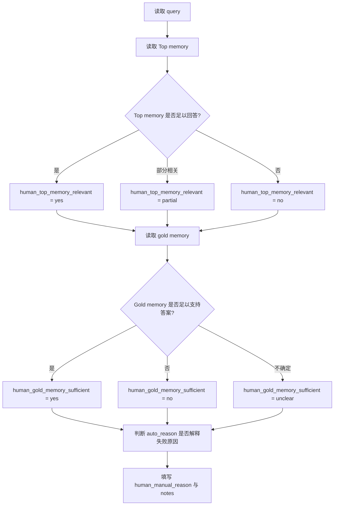

# Human Audit Annotation Codebook

本文件是人工复核标注准则，用于统一 priority20 和 full80 盲审表的填写标准。它应与盲审 CSV 和阅读包一起发给标注者，避免不同人对 yes/partial/no 的理解不一致。

## 1. 当前标注材料

- priority20 盲审 CSV：`outputs/agent_memory_human_audit_priority20_blind_review.csv`，样本数 `20`。
- priority20 阅读包：`outputs/agent_memory_human_audit_priority20_review_packet_zh.md`。
- full80 盲审 CSV：`outputs/agent_memory_human_audit_full80_blind_review.csv`，样本数 `80`。
- full80 阅读包：`outputs/agent_memory_human_audit_full80_review_packet_zh.md`。

## 2. 标注原则

1. 先读 query，再读 Top memory，最后读 gold memory；不要参考 LLM-assisted 预标注。
2. 判断以“该记忆能否支持 query 答案”为核心，不以文本表面相似度为核心。
3. 如果 Top memory 只匹配人物或主题，但缺少答案事实，通常标为 `partial`，不是 `yes`。
4. 如果 gold memory 本身不足或疑似标错，优先在 `human_gold_memory_sufficient` 中标 `no` 或 `unclear`。
5. `human_manual_reason` 尽量使用统一短标签；复杂样本在 `human_auditor_notes` 解释。
6. 双人标注时，A/B 标注者独立填写；仲裁者只处理 A/B 不一致样本。

## 3. 字段判定规则

| Field | Question | Allowed | Yes Rule | Partial Rule | No/Other Rule |
| --- | --- | --- | --- | --- | --- |
| human_auto_reason_correct | 自动错误类型 auto_reason 是否准确解释了 Top-1/Top-K 失败原因？ | yes \| partial \| no | auto_reason 与人工看到的主要失败原因一致，即使措辞不完全相同也可标 yes。 | auto_reason 捕捉到部分原因，但遗漏了更关键的因素，或多个原因并存。 | auto_reason 与样本证据明显不符，或真正原因属于另一类。 |
| human_top_memory_relevant | Top memory 是否能够回答或部分回答 query？ | yes \| partial \| no | Top memory 直接包含答案，或包含足以唯一推出答案的事实。 | Top memory 与 query 主题、人物或时间相关，但缺少关键答案事实。 | Top memory 与 query 无关、人物/时间错误，或会导致错误答案。 |
| human_gold_memory_sufficient | Gold memory 是否足以支持 query 的答案判断？ | yes \| no \| unclear | Gold memory 单独或作为 gold set 的一部分，能支持正确答案。 | - | Gold memory 与 query 不匹配，或缺少回答 query 所需的关键事实。 |
| human_manual_reason | 人工给出的主要错误类型或补充原因。 | free text | 优先使用短标签，例如 gold_below_top20、memory_type_mismatch、temporal_neighbor、entity_confusion、gold_insufficient、other。 | - | 不要留空；不确定时写 unclear 并在 notes 解释。 |
| human_auditor_notes | 人工备注。 | free text | 记录让你做出判断的关键词、时间线、人物名或冲突证据。 | - | 如果判断很直接，可以写 short note；不要写 API key、私人账号或无关信息。 |

## 4. 推荐人工错误类型

| Label | Definition | When To Use |
| --- | --- | --- |
| gold_below_top20 | 正确 gold memory 存在于记忆库，但在当前检索 Top-20 之后或未被候选池覆盖。 | Top memory 明显不够，gold memory 本身能回答 query。 |
| memory_type_mismatch | 模型召回了相关人物或主题，但 memory type 与 query intent 不匹配。 | 例如 query 询问关系/计划/地点，Top memory 却是情绪/爱好等弱相关事实。 |
| temporal_neighbor | Top memory 与 query 的时间邻近，但不是目标时间点或目标事件。 | 常见于日期、月份、最近/之后/之前等时效性问题。 |
| entity_confusion | Top memory 的事件类型相似，但人物、对象或群体混淆。 | 例如 John/Joanna/Maria 等人物错配，或不同朋友/家人被混用。 |
| multi_evidence_missing | 需要多个 gold memory 才能回答，但 Top-K 只覆盖了其中一部分。 | Type 3 或比较/归纳类 query；适合在 notes 中写缺少哪一条证据。 |
| gold_insufficient | gold memory 本身不足以支持 query 答案，或 gold set 疑似标注不完整。 | 先把 human_gold_memory_sufficient 标为 no/unclear，再使用该 reason。 |
| other | 不属于上述类别，或多个问题混合且难以归为单一原因。 | 必须在 notes 写清楚具体原因。 |

## 5. 决策流程



## 6. 回填与重算命令

### 6.1 priority20 最小人工抽查

完成 priority20 盲审 CSV 后，先把盲审表回填到 Human/LLM confirmation 表：

```bash
PYTHONPYCACHEPREFIX=/private/tmp/agent_memory_pycache \
work/agent_memory_experiment/.venv/bin/python work/agent_memory_experiment/blind_human_audit_labels.py merge \
  --scope priority20 \
  --confirmation-csv outputs/agent_memory_human_llm_audit_priority20_confirmation.csv \
  --blind-csv outputs/agent_memory_human_audit_priority20_blind_review.csv \
  --output-confirmation-csv outputs/agent_memory_human_llm_audit_priority20_confirmation.csv \
  --output-report outputs/agent_memory_human_audit_priority20_blind_review_zh.md
```

再重算 priority20 的 Human/LLM agreement：

```bash
PYTHONPYCACHEPREFIX=/private/tmp/agent_memory_pycache \
work/agent_memory_experiment/.venv/bin/python work/agent_memory_experiment/confirm_llm_audit_labels.py \
  --llm-audit-csv outputs/agent_memory_llm_audit_sample_type_aware.csv \
  --audit-id-csv outputs/agent_memory_human_llm_audit_priority20_ids.csv \
  --confirmation-csv outputs/agent_memory_human_llm_audit_priority20_confirmation.csv \
  --output-summary-csv outputs/agent_memory_human_llm_audit_priority20_agreement.csv \
  --output-report outputs/agent_memory_human_llm_audit_priority20_agreement_zh.md
```

最后重算人工复核 readiness gate，并刷新投稿总 gate：

```bash
PYTHONPYCACHEPREFIX=/private/tmp/agent_memory_pycache \
work/agent_memory_experiment/.venv/bin/python work/agent_memory_experiment/validate_human_audit_readiness.py \
  --full-confirmation outputs/agent_memory_human_llm_audit_confirmation.csv \
  --priority-confirmation outputs/agent_memory_human_llm_audit_priority20_confirmation.csv \
  --output-csv outputs/agent_memory_human_audit_readiness_gate.csv \
  --output-report outputs/agent_memory_human_audit_readiness_gate_zh.md

PYTHONPYCACHEPREFIX=/private/tmp/agent_memory_pycache \
work/agent_memory_experiment/.venv/bin/python work/agent_memory_experiment/validate_submission_readiness.py \
  --output-report outputs/agent_memory_submission_readiness_zh.md \
  --output-csv outputs/agent_memory_submission_readiness.csv
```

### 6.2 full80 完整人工确认

full80 使用同一流程，替换为 full80 对应文件：`agent_memory_human_audit_full80_blind_review.csv`、`agent_memory_human_llm_audit_confirmation.csv`、`agent_memory_human_llm_audit_agreement.csv`。如果时间有限，先完成 priority20；如果准备投稿，full80 也需要补齐。

### 6.3 提交前复现刷新

人工字段更新后，建议同步重跑 evidence matrix、submission gap、reproducibility checklist 和 artifact integrity manifest，使论文草稿、差距分析、投稿 gate 里的 blocker 数保持一致。

## 7. 一致性指标公式

令第 `i` 个样本在某字段上的人工标签为 `h_i`，LLM-assisted 标签为 `l_i`，双人标注时 A/B 标注分别为 `a_i` 和 `b_i`：

- Exact agreement: `A_exact = (1/N) * sum_i 1[h_i = l_i]`，双人标注时把 `h_i/l_i` 替换为 `a_i/b_i`。
- Partial-credit agreement: 对 `yes/partial/no`，完全一致计 1，`yes` 与 `partial` 或 `partial` 与 `no` 计 0.5，`yes` 与 `no` 计 0。
- Cohen's kappa: `kappa = (p_o - p_e) / (1 - p_e)`，其中 `p_o` 是观测一致率，`p_e` 是由两个标注者边际分布估计的随机一致率。

报告时应同时说明样本范围：priority20 是快速抽查，full80 才能支撑完整错误分析；双人/仲裁完成后再把 adjudicated labels 作为最终人工分布。

## 8. 论文写法边界

- priority20 未完成前，只能写“已准备 quick-review protocol”，不能写人工抽查结果。
- priority20 完成后，可以写小样本人工抽查和 Human/LLM agreement。
- full80 完成后，才可以写完整 human-verified error analysis。
