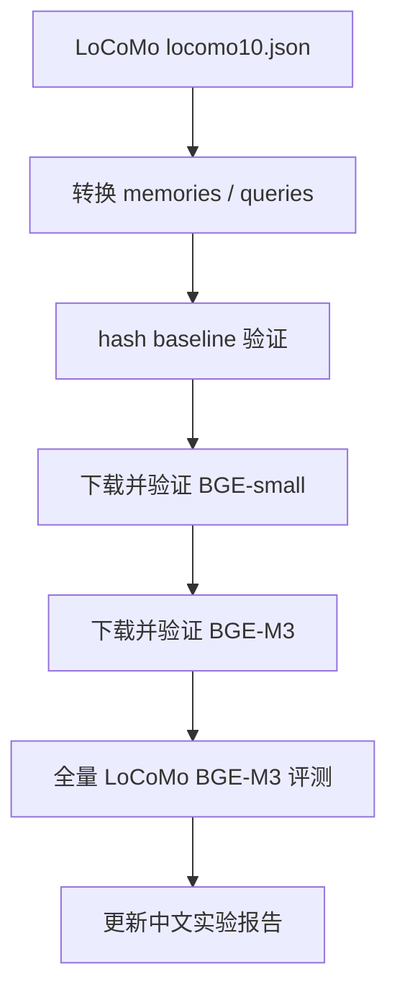

# 智能体记忆项目：本地 BGE、GPU 与 API 使用计划

## 1. 当前结论

当前阶段不需要 OpenAI embedding API，也不需要 Qwen embedding API。路线调整为：

```text
hash baseline -> 本地 BGE-small -> 本地 BGE-M3 -> 后续可选 DeepSeek LLM
```

其中：

| 模块 | 当前选择 | 是否需要 API key |
|---|---|---:|
| 记忆检索 baseline | `hash` | 否 |
| 真实 embedding 快速验证 | `BAAI/bge-small-en-v1.5` | 否 |
| 正式 embedding 主线 | `BAAI/bge-m3` | 否 |
| 事实抽取/压缩/回答生成 | 后续可接 DeepSeek API | 是 |

## 2. 没有 3080 是否可以

可以。当前 LoCoMo 数据规模是 5882 条 memory、1986 个 query，不需要 3080 才能开始。

你的机器即使不是 3080，也可以完成：

1. LoCoMo 数据转换。
2. hash baseline 评测。
3. BGE-small 本地 embedding 验证。
4. BGE-M3 小规模验证。
5. 后续用 DeepSeek API 做事实抽取或回答生成。

GPU 主要影响“本地 embedding 生成速度”和“本地 LLM 推理速度”。如果调用 API，本地 GPU 基本不参与计算。

## 3. BGE-small 与 BGE-M3 的角色

| 模型 | 作用 | 为什么这样安排 |
|---|---|---|
| `BAAI/bge-small-en-v1.5` | 快速 smoke test | 先确认依赖、模型下载、离线加载、评测输出都正常 |
| `BAAI/bge-m3` | 正式主线 | 多语言、长文本能力更强，更适合智能体记忆/RAG |

建议不要一开始就只跑 BGE-M3，因为如果环境、依赖、数据路径有问题，大模型下载和加载会浪费时间。先用 small 把链路跑通，再换 M3。

## 4. 下载与缓存

模型第一次运行需要联网下载。当前项目把缓存放在：

```text
work/agent_memory_experiment/cache/huggingface
work/agent_memory_experiment/cache/sentence_transformers
```

下载完成后，运行时使用：

```text
--local-files-only
```

这样可以强制只读本地缓存，方便复现实验。

## 5. API 现在是否需要

当前 embedding 不需要 API。只需要下载 BGE 模型到本地。

DeepSeek API 可以后续使用，适合这些任务：

1. 从对话 turn 抽取结构化 memory。
2. 做 memory update / conflict detection。
3. 把多条旧记忆压缩成 fact 或 summary。
4. 根据检索到的记忆生成最终回答。

但这些属于下一阶段；现在先把检索层验证稳。

## 6. 当前执行顺序



## 7. 费用判断

本地 BGE embedding 的 API 费用为 0。成本主要是：

1. 首次下载模型的时间和网络流量。
2. 本地运行时间。
3. 磁盘缓存空间。

如果后续接 DeepSeek LLM，费用取决于 prompt 长度、调用次数和输出长度；它不影响当前 BGE embedding 路线。

## 8. 资料来源

- BGE-small: https://huggingface.co/BAAI/bge-small-en-v1.5
- BGE-M3: https://huggingface.co/BAAI/bge-m3
- Sentence Transformers: https://www.sbert.net/
- DeepSeek API: https://api-docs.deepseek.com/zh-cn/
