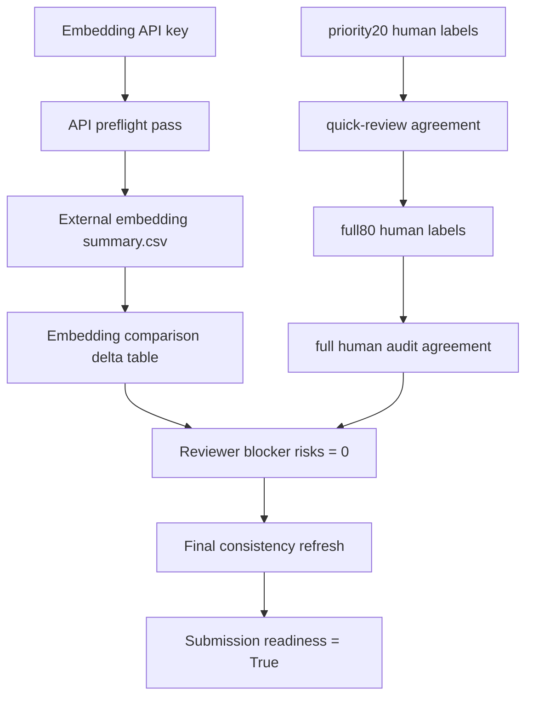

# Submission Blocker Closure Plan

本文件把最终投稿前仍未通过的 gate 串成最短关闭路线。它不会把 pending 项写成完成结果；它的作用是说明下一次拿到 API key 或人工标签后，应该按什么顺序执行、用什么证据判断通过，以及论文措辞可以如何升级。

## 总览

- Closure steps: 6
- Hard external input: embedding API key; human labels for priority20/full80.
- Current status: protocol-ready, not final-submission ready.

## 关闭路线

| Order | Blocker Group | Current Gate | Minimum Action | Acceptance Criterion | Paper Upgrade |
| --- | --- | --- | --- | --- | --- |
| 1 | external_embedding_preflight | 4/5 required checks pass | Set OPENAI_API_KEY in .env or shell, then rerun preflight. | api_embedding_preflight pass=True; no key value is written to Git. | API baseline can move from pending protocol to safe-to-run experiment. |
| 2 | external_embedding_completed | completed external embedding baselines=0, postrun_pass=0 | Run memory_eval.py with semantic-backend api and generate summary.csv. | external embedding summary.csv exists and compare_embedding_baselines.py reports numeric deltas vs BGE-M3. | External embedding baseline can be added to the embedding comparison table. |
| 3 | priority20_human_audit | priority20 confirmed=0/20, invalid=0 | Fill human_manual_reason, human_auto_reason_correct, human_top_memory_relevant, human_gold_memory_sufficient, and human_auditor_notes for all 20 rows. | 20/20 samples have valid human_* labels after merge and agreement recomputation. | quick-review Human/LLM agreement can be reported. |
| 4 | full80_human_audit | full80 confirmed=0/80, invalid=0 | Complete the same human_* fields for all 80 rows after priority20 labels are stable. | 80/80 samples have valid human_* labels after merge and agreement recomputation. | full Human/LLM audit agreement can be reported. |
| 5 | reviewer_risk_blockers | blocker risks=2 | Regenerate reviewer response prep and submission gap analysis after external embedding and human audit gates pass. | reviewer_risk_blockers pass=True and blocker risks=0. | The manuscript can move from internal draft to final-submission candidate. |
| 6 | final_consistency_refresh | freshness/integrity/claim checks must remain synchronized | Run evidence matrix, manuscript, claim check, reproducibility checklist, artifact manifest, freshness audit, and submission readiness after blocker closure. | claim failures=0; stale_count_findings=0; artifact gate passes; final submission readiness=True. | Final paper claims and appendix evidence are aligned with completed experiments. |

## 依赖图

## 执行边界

- 可以先关闭 priority20，形成小样本 quick-review evidence；但最终投稿仍需要 full80 或在论文中明确写成 limited audit。
- 可以先跑一个外部 embedding provider；不必同时跑 OpenAI 和 generic provider。
- 每关闭一个 blocker 后都必须刷新 submission gap、reviewer response、manuscript claim check 和 freshness audit。
- 在 external_embedding_completed 和 human audit gates 通过前，正文仍应保留 pending/limitation 措辞。
