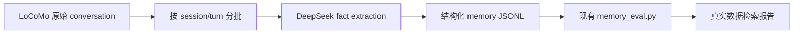

# DeepSeek 官方 API 接入方法

## 1. 获取 API Key

1. 打开 DeepSeek 官方平台：https://platform.deepseek.com/
2. 注册或登录账号。
3. 进入 API Keys 页面。
4. 创建新的 API key。
5. 立刻复制并保存。API key 只完整显示一次。

注意：不要把 API key 发给别人，不要上传到 GitHub，不要直接写进代码。

## 2. 本地临时配置

在终端里临时配置：

```bash
export DEEPSEEK_API_KEY="你的 DeepSeek API key"
```

只在当前终端窗口有效，适合先测试。

如果要长期配置，可以之后再写入 `~/.zshrc`，但不建议一开始就长期保存，先临时测试更稳。

## 3. DeepSeek API 基本参数

官方文档说明 DeepSeek 支持 OpenAI-compatible 调用方式：

| 参数 | 推荐值 |
|---|---|
| API key 环境变量 | `DEEPSEEK_API_KEY` |
| base_url | `https://api.deepseek.com` |
| 接口 | `/chat/completions` |
| 推荐便宜模型 | `deepseek-v4-flash` |
| 推荐强模型 | `deepseek-v4-pro` |

注意：DeepSeek 模型名会随官方平台更新。以你控制台和官方价格页当前可选模型为准；如果 `deepseek-v4-flash` 不可用，可以先用官方兼容名 `deepseek-chat` 做连通性测试。

## 3.1 当前价格核对

根据 DeepSeek 官方价格页，当前需要重点关注：

| 模型 | 输入 cache hit | 输入 cache miss | 输出 |
|---|---:|---:|---:|
| DeepSeek-V4-Flash | $0.0028 / 1M tokens | $0.14 / 1M tokens | $0.28 / 1M tokens |
| DeepSeek-V4-Pro | $0.003625 / 1M tokens | $0.435 / 1M tokens | $0.87 / 1M tokens |

解释：

- `cache miss`：第一次输入或未命中缓存，按正常输入价格计费。
- `cache hit`：相同前缀/上下文命中缓存，输入价格会非常低。
- 输出 token 通常比输入 token 贵，所以批量抽取时要控制输出 JSON 长度。

## 4. 最小 Python 测试

先安装 OpenAI SDK：

```bash
pip3 install openai
```

测试代码：

```python
import os
from openai import OpenAI

client = OpenAI(
    api_key=os.environ["DEEPSEEK_API_KEY"],
    base_url="https://api.deepseek.com",
)

response = client.chat.completions.create(
    model="deepseek-v4-flash",
    messages=[
        {"role": "system", "content": "你是一个帮助做智能体记忆实验的助手。"},
        {"role": "user", "content": "请用一句话解释什么是长期记忆检索。"},
    ],
    stream=False,
    extra_body={"thinking": {"type": "disabled"}},
)

print(response.choices[0].message.content)
```

如果上面模型名暂时不可用，可把 `model` 换成你控制台支持的模型名，例如：

```python
model="deepseek-chat"
```

## 5. 在本项目中怎么用

DeepSeek 更适合接入以下模块：

| 模块 | 是否建议用 DeepSeek | 原因 |
|---|---:|---|
| 事实抽取 | 建议 | 便宜，适合批量从对话 turn 中抽取 memory fact |
| 压缩摘要 | 建议 | 可替换当前规则压缩 |
| 冲突判断 | 建议 | 判断新增/更新/删除/noop |
| 最终回答生成 | 可以 | 用于 LoCoMo QA 回答生成 |
| embedding 检索 | 不优先 | DeepSeek 主要是 chat/reasoning API，当前项目 embedding 建议用本地模型或专门 embedding API |

推荐第一步接：

```text
extract_memories_llm.py
```

输入 LoCoMo 对话，输出当前评测器已经支持的 JSONL：

```text
*_memories.jsonl
*_queries.jsonl
```

这样不会破坏已有检索/评估流程。

## 6. 费用控制建议

1. 先只跑 `--max-records 1`，确认 prompt 和 JSON 输出稳定。
2. 再跑全量 10 个 LoCoMo conversation。
3. 每次调用前估算 token 数。
4. 给输出设置较短 `max_tokens`。
5. 把 LLM 抽取结果缓存到文件，避免重复调用。

本项目推荐先用 DeepSeek 做“批量事实抽取”，不要一开始就对 1986 个 LoCoMo query 全部生成长回答。

## 7. 后续代码接入计划

建议新增：

```text
work/agent_memory_experiment/extract_memories_llm.py
work/agent_memory_experiment/llm_clients.py
work/agent_memory_experiment/prompts/memory_extraction_zh.md
work/agent_memory_experiment/cache/llm_extractions/
```

核心流程：



## 8. 官方资料

- DeepSeek 官方平台：https://platform.deepseek.com/
- DeepSeek API 文档：https://api-docs.deepseek.com/
- Chat Completion 文档：https://api-docs.deepseek.com/api/create-chat-completion
- 官方价格页：https://api-docs.deepseek.com/quick_start/pricing
